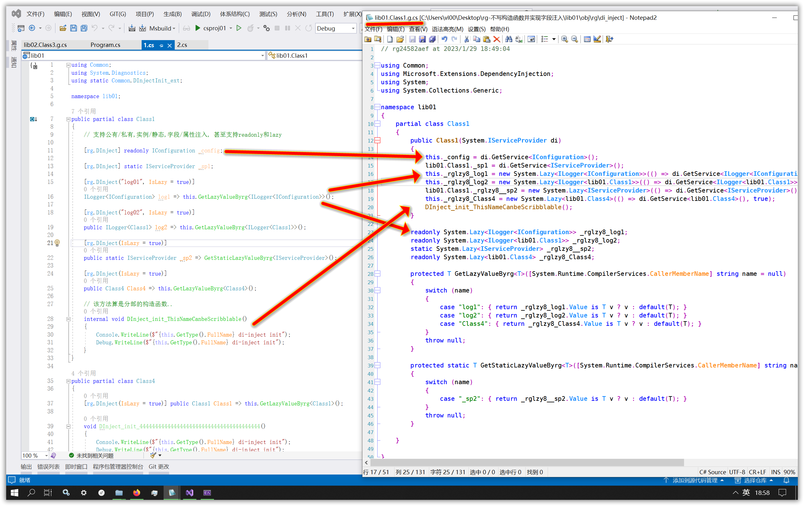

# rg-不写构造函数并实现字段注入

很多时候用Ioc/DI时，你都会觉得构造函数非常繁琐。90%的构造函数就是把注入的参数赋值到类的字段。
如果你使用autofac，你可能会使用属性注入。但是属性注入性能是比不过构造函数注入的，而且你还有可能会硬性把属性公开。。

那有无办法<b>既不用写构造函数实现字段注入而又性能跟构造函数注入一样</b>？本sample使用<b>roslyn</b>相关技术实现该要求，如图：



运行方法(windows)：
``` cmd
打开cmd命令行, cd到readme.md的目录后，运行
dotnet restore
rg.di_inject
cd ./csproj01
dotnet run
```